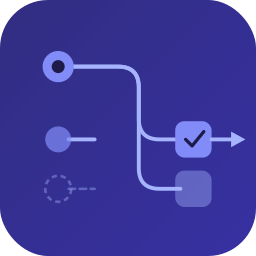

<p align="center">
  
</p>

<h1 align="center">@rytejs/core</h1>

<p align="center">Type-safe workflow engine with Zod validation and middleware pipelines.</p>

<p align="center">
  
  
</p>

## Why Ryte?

- **Fully typed from definition to dispatch** -- define your states, commands, events, and errors with Zod schemas. TypeScript infers everything automatically. State names, command payloads, event data, error codes -- all with full autocompletion, no manual type annotations.
- **Checking `workflow.state` narrows `workflow.data`** -- TypeScript knows exactly which data shape each state has. Discriminated unions, not type casts.
- **`ctx.error()` is type-checked** -- you can only raise error codes that exist in your definition, with the correct data shape. Domain failures are part of the contract.
- **Koa-style middleware** -- global, state-scoped, and inline middleware with the onion model. Add auth, logging, or validation without touching handlers.
- **Fluent builder API** -- chain `.state()`, `.on()`, `.use()` calls. Every method returns `this`.
- **Composable routers** -- split handlers across files and compose them with `.use()`. Routers are routers.
- **Zero platform lock-in** -- pure logic with no runtime dependencies beyond Zod. Works on Node.js, Bun, and Deno.

## Quick Example

```ts
import { z } from "zod";
import { defineWorkflow, WorkflowRouter } from "@rytejs/core";

const taskWorkflow = defineWorkflow("task", {
  states: {
    Todo: z.object({ title: z.string(), assignee: z.string().optional() }),
    Done: z.object({ title: z.string(), completedAt: z.coerce.date() }),
  },
  commands: {
    Complete: z.object({}),
  },
  events: {
    TaskCompleted: z.object({ taskId: z.string() }),
  },
  errors: {
    NotAssigned: z.object({ title: z.string() }),
  },
});

const router = new WorkflowRouter(taskWorkflow)
  .state("Todo", (state) => {
    state.on("Complete", (ctx) => {
      if (!ctx.data.assignee) {
        ctx.error({ code: "NotAssigned", data: { title: ctx.data.title } });
      }
      ctx.transition("Done", {
        title: ctx.data.title,
        completedAt: new Date(),
      });
      ctx.emit({ type: "TaskCompleted", data: { taskId: ctx.workflow.id } });
    });
  });

const task = taskWorkflow.createWorkflow("task-1", {
  initialState: "Todo",
  data: { title: "Read the docs", assignee: "alice" },
});

const result = await router.dispatch(task, {
  type: "Complete",
  payload: {},
});

if (result.ok) {
  console.log(result.workflow.state); // "Done"
  console.log(result.events[0]?.type); // "TaskCompleted"
} else if (result.error.category === "domain") {
  console.log(result.error.code); // "NotAssigned"
}
```

## Documentation

- [Getting Started](https://helico-tech.github.io/rytejs/guide/getting-started)
- [API Reference](https://helico-tech.github.io/rytejs/api/)
- [Examples](./examples/)

## Contributing

```bash
# Clone the repo
git clone https://github.com/helico-tech/rytejs.git
cd rytejs

# Install dependencies
pnpm install

# Run tests
pnpm test

# Lint
pnpm lint

# Build
pnpm build
```

## License

MIT
