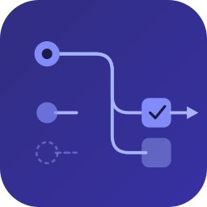

<p align="center">
  
</p>

<h1 align="center">@rytejs/core</h1>

<p align="center">Type-safe workflow engine driven by Standard Schema — works with Zod, Valibot, and ArkType.</p>

<p align="center">
  
  
</p>

## Why Ryte?

- **Fully typed from definition to dispatch** — declare states, commands, events, and errors with any [Standard Schema](https://standardschema.dev) validator. TypeScript infers everything automatically.
- **Checking `workflow.state` narrows `workflow.data`** — discriminated unions, not type casts.
- **`ctx.error()` is type-checked** — only raise error codes that exist in your definition, with the correct data shape.
- **Koa-style middleware** — global, state-scoped, and inline middleware, onion model.
- **Composable routers** — split handlers across files, merge via `.use()`.
- **Zero validator lock-in** — pick Zod, Valibot, or ArkType; mix them per state if you want. Core has no runtime dependency on any validator.

## Install

```bash
# Zero required peers. Pick your validator:
pnpm add @rytejs/core zod
# or
pnpm add @rytejs/core valibot
# or
pnpm add @rytejs/core arktype
```

## Quick Example

```ts
import { z } from "zod";
import { defineWorkflow, WorkflowRouter } from "@rytejs/core";

const taskWorkflow = defineWorkflow("task", {
  states: {
    Todo: z.object({ title: z.string(), assignee: z.string().optional() }),
    Done: z.object({ title: z.string(), completedAt: z.coerce.date() }),
  },
  commands: {
    Complete: z.object({}),
  },
  events: {
    TaskCompleted: z.object({ taskId: z.string() }),
  },
  errors: {
    NotAssigned: z.object({ title: z.string() }),
  },
});

const router = new WorkflowRouter(taskWorkflow).state("Todo", ({ on }) => {
  on("Complete", ({ data, workflow, error, transition, emit }) => {
    if (!data.assignee) {
      error("NotAssigned", { title: data.title });
    }
    transition("Done", { title: data.title, completedAt: new Date() });
    emit("TaskCompleted", { taskId: workflow.id });
  });
});

const task = taskWorkflow.createWorkflow("task-1", {
  initialState: "Todo",
  data: { title: "Read the docs", assignee: "alice" },
});

const result = await router.dispatch(task, "Complete", {});

if (result.ok) {
  console.log(result.workflow.state); // "Done"
  console.log(result.events[0]?.type); // "TaskCompleted"
} else if (result.error.category === "domain") {
  console.log(result.error.code); // "NotAssigned"
}
```

## Using a different validator

The same workflow with Valibot — identical DSL, identical types:

```ts
import * as v from "valibot";
import { defineWorkflow, WorkflowRouter } from "@rytejs/core";

const taskWorkflow = defineWorkflow("task", {
  states: {
    Todo: v.object({ title: v.string(), assignee: v.optional(v.string()) }),
    Done: v.object({ title: v.string(), completedAt: v.date() }),
  },
  commands: { Complete: v.object({}) },
  events: { TaskCompleted: v.object({ taskId: v.string() }) },
  errors: { NotAssigned: v.object({ title: v.string() }) },
});
```

ArkType works the same way via `type({...})`. Any validator that implements [Standard Schema v1](https://standardschema.dev) is supported — no adapters required.

## Documentation

- [Getting Started](https://helico-tech.github.io/rytejs/guide/getting-started)
- [Server Fields](https://helico-tech.github.io/rytejs/guide/server-fields)
- [State Groups](https://helico-tech.github.io/rytejs/guide/state-groups)
- [API Reference](https://helico-tech.github.io/rytejs/api/)
- [Examples](./examples/)

## Contributing

```bash
git clone https://github.com/helico-tech/rytejs.git
cd rytejs
pnpm install
pnpm test
pnpm lint
pnpm build
```

## License

MIT
