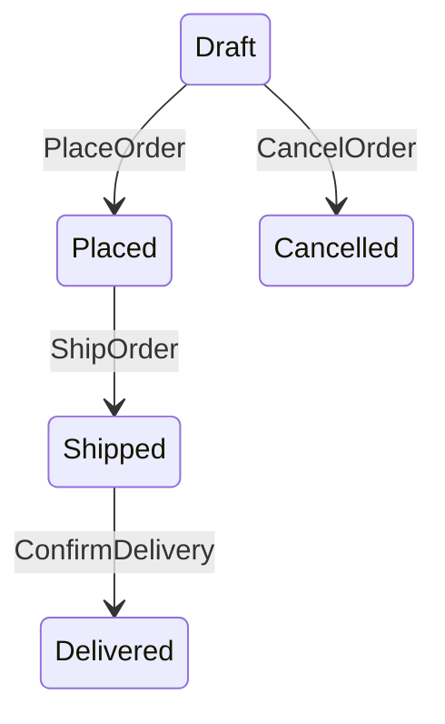

# Visualization

`@rytejs/viz` generates state diagrams from your workflow's introspection data. It outputs source code for [Mermaid](https://mermaid.js.org/) and [D2](https://d2lang.com/) — paste into docs, pipe to a CLI, or feed into devtools.

## Installation

```bash
npm install @rytejs/viz
# or
pnpm add @rytejs/viz
```

`@rytejs/core` is a peer dependency.

## Generating Diagrams

Use `router.inspect()` to get the transition graph, then pass it to `toMermaid()` or `toD2()`:

```ts
import { WorkflowRouter } from "@rytejs/core";
import { toMermaid, toD2 } from "@rytejs/viz";

const router = new WorkflowRouter(definition);
// ... register handlers with targets ...

const graph = router.inspect();
```

### Mermaid

```ts
console.log(toMermaid(graph));
```

Output:



GitHub renders Mermaid natively in markdown — paste the output into a ` ```mermaid ` block in your README.

### D2

```ts
console.log(toD2(graph));
```

Output:

```
Draft
Placed
Shipped
Delivered
Cancelled

Draft -> Placed: PlaceOrder
Draft -> Cancelled: CancelOrder
Placed -> Shipped: ShipOrder
Shipped -> Delivered: ConfirmDelivery
```

## Options

Both functions accept an optional second argument:

```ts
toMermaid(graph, {
	title: "Order Flow",          // adds a title to the diagram
	highlightTerminal: true,      // marks states with no outgoing transitions
});
```

| Option | Default | Effect |
|--------|---------|--------|
| `title` | none | Adds a title (Mermaid frontmatter / D2 comment) |
| `highlightTerminal` | `false` | Highlights states with no outgoing transitions |

### Terminal States

With `highlightTerminal: true`, states that have no outgoing transitions are marked:

- **Mermaid:** `Delivered --> [*]` (end pseudostate)
- **D2:** `Delivered.style.fill: "#e0e0e0"` (gray fill)

## Targets Required

The diagram quality depends on declaring `targets` on your handlers. Without targets, `inspect()` reports transitions with an empty `to` array and the diagram shows no edges for those handlers.

```ts
// This handler IS visible in the diagram
state.on("PlaceOrder", { targets: ["Placed"] }, handler);

// This handler is NOT visible (no targets declared)
state.on("PlaceOrder", handler);
```
